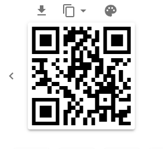
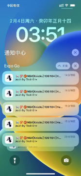
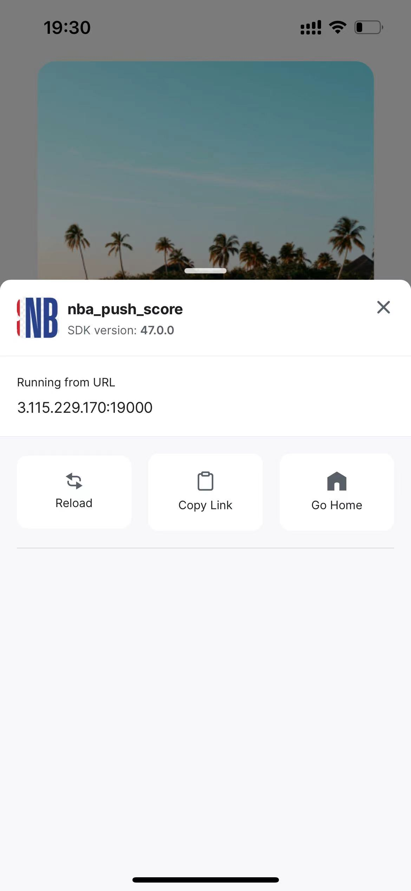

# NBA Push Score Expo App

## Product Server Setup
### 1, Start Server
```
npx expo login  #must login first
nohup npx expo start -c --no-dev  &
```
### 2, Generate QR Code(The below Demo)
Using `exp://{your-server-ip}:19000` to generate a QR Code, you can use any tool. for example [qrcode-generator](https://www.the-qrcode-generator.com/)

## User installation
### 1, pls visit https://expo.dev/client to download "Expo Go" App
### 2, Scan the QR code below with Expo Go (Android) or the Camera app (iOS)


### 3, after Download && Install, pls grant "Push notification" function.


>if the user download fail, pls shake phone, then click "Reload", it will renew download.





* [https://china.nba.cn/](https://china.nba.cn/)
* [https://www.nba.com/games](https://www.nba.com/games)


## Other Development Experience

- [push notification without firebase tutorials](https://www.youtube.com/watch?v=IEiZy0pcMMA)
- https://app.nativenotify.com/


1. expo build android apk
https://docs.expo.dev/build-reference/apk/

 ```shell
eas build -p android --profile preview --local --output output/android

adb devices
adb -s 72a1e28e install application-b6ba2795-20f9-4a8c-a41e-a2c7d9693392.apk 
```

2. no development, allow offline
```shell
npx expo start -c --no-dev  --offline 
npx expo start -c  --offline 

npx expo start -c --no-dev 
```

3. all user install
```shell
npx expo start -c --no-dev --tunnel
```

4. local build ios
[local build ios]](https://docs.expo.dev/app-signing/local-credentials/)